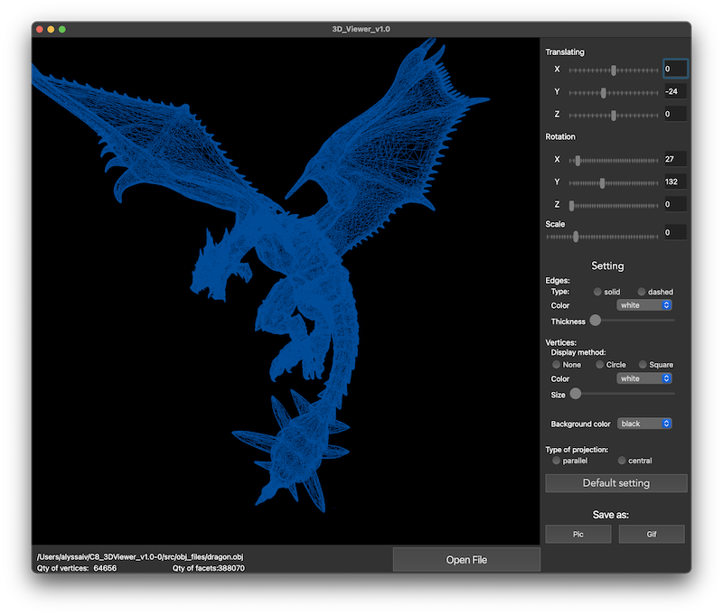

# About 3D viewer

Program to view 3D wire-frame models in C/C++
Using the program, you can open .obj files, scale, move and rotate them.
You can also take a screenshot and GIF of the model.

---

---

# Makefile commands:

1. install - to install the application
2. uninstall - to uninstall the application
3. run - to run the application
4. dvi - to open a readmi 
5. dist - to create a distribution tar file for this program
6. test - to run test
7. gcov_report - to show code coverage with tests
   

- _alyssaiv_
- _neelyrha_
- _school 21, 2022_

---